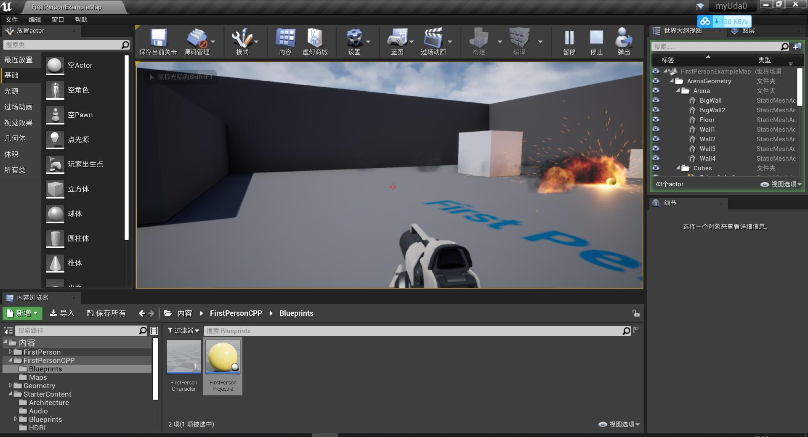
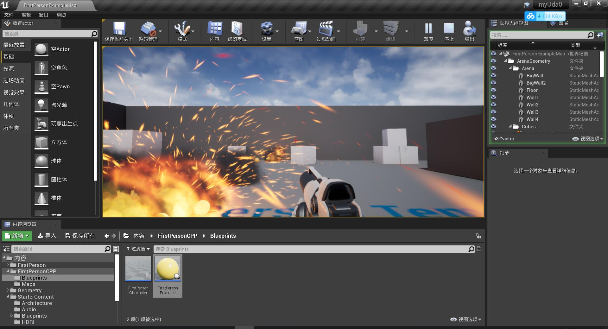

# 20201104

上午：

* 找教程
* 观看学习[[中文视频] 虚幻引擎4 编辑器基础教学](https://www.bilibili.com/video/BV16x41167mW)，了解 Unreal Engine 界面窗格等基本内容。

下午：

* 找教程，最终确定了两个课程
  * 《[Unreal Engine 4 Mastery：Create Multiplayer Games with C++](https://www.bilibili.com/video/BV1pb41177pn)》
  * 《[Unreal Engine C++ Developer: Learn C++ and Make Video Games](https://www.udemy.com/course/unrealcourse/)》

* Unreal Engine 官网教程几乎均为英语，外嵌字幕为黑色，与 Unreal Engine 客户端颜色相似，导致几乎都看不了。

* 跟着做一丢丢，改入门 demo 实现射击碰撞爆炸效果：

