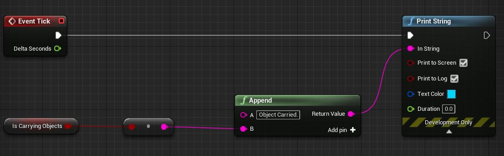
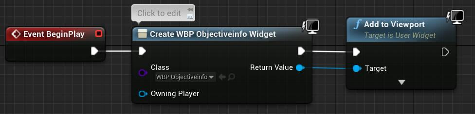
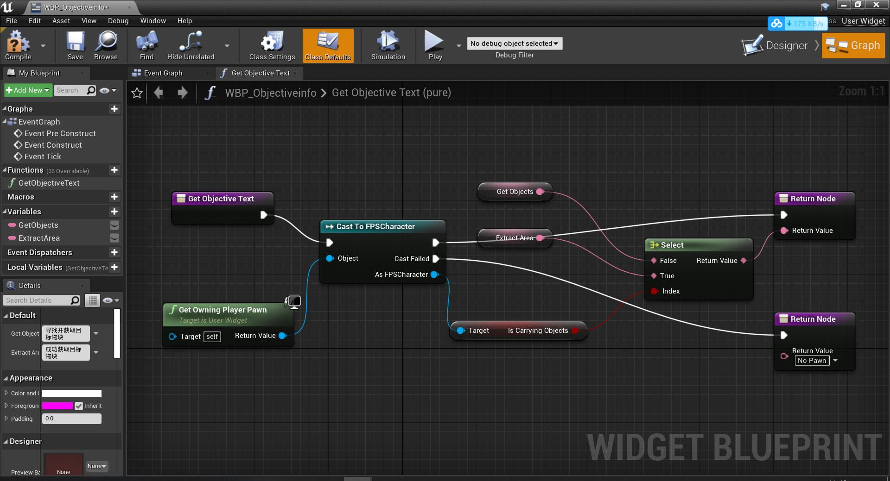

# 20201105

安装 Visual Assiant 插件，方便头文件与函数接口的查找


### SECTION 2 上午

StealthGameProjectBase418.zip

解压后在 FPSCharacts.cpp 下会有三处两个报错：

```C++
CameraComponent->RelativeLocation = FVector(0, 0, BaseEyeHeight); // Position the camera
//...
Mesh1PComponent->RelativeRotation = FRotator(2.0f, -15.0f, 5.0f);
Mesh1PComponent->RelativeLocation = FVector(0, 0, -160.0f);
```

经查 在class ENGINE_API USceneComponent 下有

```C++
private:
	/** Location of the component relative to its parent */
	UPROPERTY(EditAnywhere, BlueprintReadOnly, ReplicatedUsing=OnRep_Transform, Category = Transform, meta=(AllowPrivateAccess="true"))
	FVector RelativeLocation;

	/** Rotation of the component relative to its parent */
	UPROPERTY(EditAnywhere, BlueprintReadOnly, ReplicatedUsing=OnRep_Transform, Category=Transform, meta=(AllowPrivateAccess="true"))
	FRotator RelativeRotation;
```

应该是版本问题，public 成员可见范围成为 private 了，因故将上述代码改为 set 方法即可。


ue4中，新建 C++ Actor 类，FPSObjectiveActor。.cpp 中默认有三个函数: 构造函数、BeginPlay()、Tick(float DataTime)。

构造函数中 PrimarilyActorTick.bCanEverTick = true 使得每一帧都会执行一次 Tick().


UE4 中新建 蓝图类，类型为 Object 命名为 BP_Objective


在FPSObjective.h 添加：

```C++
proteced:
    // 设置可见
    UPROPERTY(VisibleAnyWhere, Category = "Compoment");
    // 网格组件，为了说明一个物体确实存在
    UStaticMeshComponent* MeshComp; 

    // 设置可见
    UPROPERTY(VisibleAnyWhere, Category = "Compoment");
    // 球体组件，接受物体碰撞信息
    USphereComponent* SphereComp;

// 记得FPSObjective.h前向声明：
// class USphereComponent;
```
FPSObjective.cpp 构造函数中添加：

```C++
MeshComp = CreateDefaultSubobject<UStaticMeshComponent>(TEXT("MeshComp"));
// 碰撞，也可以先不添加
MeshComp->SetCollisionEnabled(ECollisionEnabled::NoCollision);
// 指定跟组件
RootComponent = MeshComp;

SphereComp = CreateAbstractDefaultSubobject<USphereComponent>(TEXT("SphereComp"));
// 碰撞，也可以先不添加
SphereComp->SetCollisionEnabled(ECollisionEnabled::QueryOnly);
// 设置响应通道
SphereComp->SetCollisionResponseToAllChannels(ECR_Ignore);
// 人形+重叠方响应
SphereComp->SetCollisionResponseToChannel(ECC_Pawn, ECR_Overlap);
// 球体组件附加到网格上
SphereComp->SetupAttachment(MeshComp);
```


UE4 中 full blueprint editor 视图下编辑 BP_Objective

选中MeshComp，右侧编辑StaticMesh，选择EditorSphere。（要是找不到这个，在viewOptions多勾选几个Content）。设置同比例缩放scale为0.2。

选中SphereComp，右侧编辑Shape设为300左右的Sphere Radius。

可以在此 full blueprint editor 界面设置碰撞，也可以在C++代码中。后者见上述代码。并添加响应方法：	

```C++
// protected:
//    void PlayEffects();
//
//    UPROPERTY(EditDefaultsOnly, Category = "Effects")
//    UParticleSystem* PickupFX;

void AFPSObjectiveActor::PlayEffects()
{
	UGameplayStatics::SpawnEmitterAtLocation(this, PickupFX, GetActorLocation());
}
```

之后要在合适的地方调用PlayEffects()

```C++
// 两种方式。
// 一、构造函数中：
// SphereComp->OnComponentBeginOverlap

// 二、重写父亲方法
//public:	
//	//// Called every frame
//	//virtual void Tick(float DeltaTime) override;
//
//	virtual void NotifyActorBeginOverlap(AActor* OtherActor) override;

void AFPSObjectiveActor::NotifyActorBeginOverlap(AActor* OtherActor)
{
	Super::NotifyActorBeginOverlap(OtherActor);

	PlayEffects();
}
```

 UE4中打开 BP_Objective 的 full blueprint editor，选中BP_Objective(self)，右侧多出含有Pickup FX的Effects，将Pickup FX效果设为P_gold_ore_received。这样每次玩家角色碰到球时，会触发特效。


将物块设为拾取一次即销毁。

```C++
// FPSCharacter.h
// public:
//     UPROPERTY(BlueprintReadOnly, Category = "Gameplay")
//     bool bIsCarryingObjects;

// FPSObjectiveActor.cpp
void AFPSObjectiveActor::NotifyActorBeginOverlap(AActor* OtherActor)
{
	Super::NotifyActorBeginOverlap(OtherActor);

	PlayEffects();

	AFPSCharacter* myCharacter = Cast<AFPSCharacter>(OtherActor);
	if (myCharacter) {
		myCharacter->bIsCarryingObjects = true;

		Destroy();
	}
}
```

此时可以删除 FPSObjectiveActor 的 Tick() 函数，以及其构造函数中的 bCanEverTick 设为 true 那一句。

打开 Content/Blueprints/BP_Player的 full blueprint editor，设置如下 eventGraph，这样可以根据 FPSCharacter的成员bIsCarryingObjects状态来打印输出在屏幕字符串:




在 Content/UI 目录下，新建 User Interface 并命名 WBP_ObjectiveInfo (Widget BluePrint)，在 full blueprint editor 中左侧添加个common 类别的 text 组件，调整文本内容，eg:寻找并拾取目标。


在 Content/Blueprints 目录下，新建 FPSHUD 的 Blueprint 类并命名 BP_HUD，在 full blueprint editor 中设置如下 event graph:




在 Content/Blueprints 目录下，新建 GameMode 的 Blueprint 类并命名 BP_GameMode，在 full blueprint editor 右侧 Classes 的 HUD Class 设为 BP_HUD。


在主界面，打开 Window-World Settings，设置 Game Mode 的 GameMode Override 为 BP_GameMode。这样将上述字符文本添加到了视图，但是文本没有什么变化。


在Conetnt/UI,打开WBP_Objectiveinfo 的 full blueprint Editor，为text 新增 bindEvent,设为如下：




### SECTION 3 下午

* Create game rules to handle mission complete and game over states

* Create extraction zone for the player to bring objective from previous section

* Create launch pad to shoot player and objects into the air


DecalCompenent 贴图挺难搞的，存在显示不清，且只有一个面有效果需要来回旋转查找确定；

跟着课程做时，误 include 的一个 cpp 文件，编译不通过。调试查看堆栈时，发现是在自己调用 CreateDefaultSubobject<>() 函数的地方，于是去查找这个函数相关内容但没找出原因。最后根据报错代码 链接器工具错误 LNK2005 排除头文件才找到。

上述两件事情导致 SECTION 3 只进行了一半，并认识到了缺乏对理论框架的学习，直接动手写 demo 可能会在以后排查问题时浪费更多的时间精力。最终确立了这本书：

[《大象无形：虚幻引擎程序设计浅析》](https://book.douban.com/subject/27033749/)


附命名参考：

```markdown
* emitter
	发射器

* pawn
	n.(国际象棋的)兵，卒;被利用的人;走卒
	v.质押;典当
	
* mesh
	n.网状物;网状织物;陷阱;困境;圈套
	v.(使)吻合，相配，匹配，适合;啮合
	
* particle
	微尘;粒子系统;顆粒;颗粒度;分子
	
* overlap
	v.(物体)部分重叠，交叠;使部分重叠;(时间上)部分重叠
	n.(范围方面的)重叠部分;(物体的)重叠部分，重叠量;(两事发生的)重叠时间，交接时期
	

```

