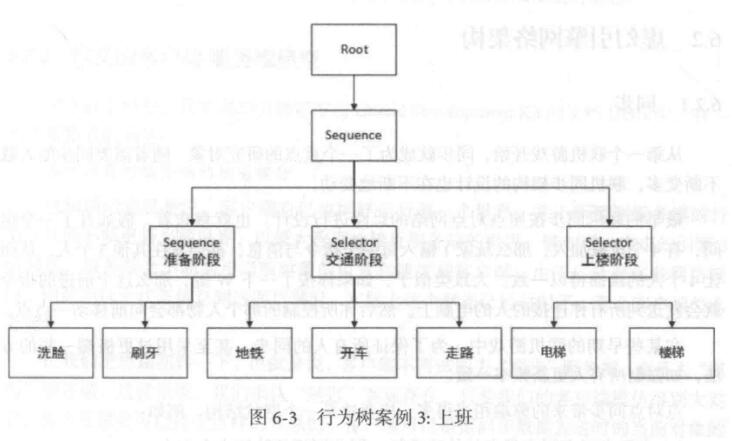
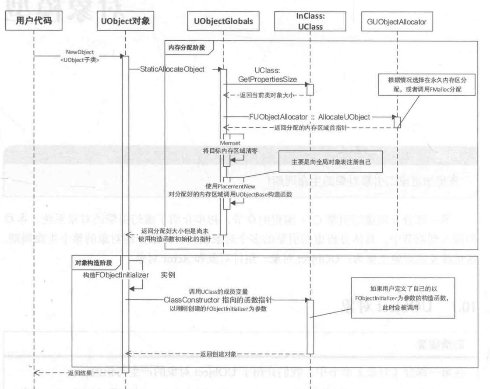
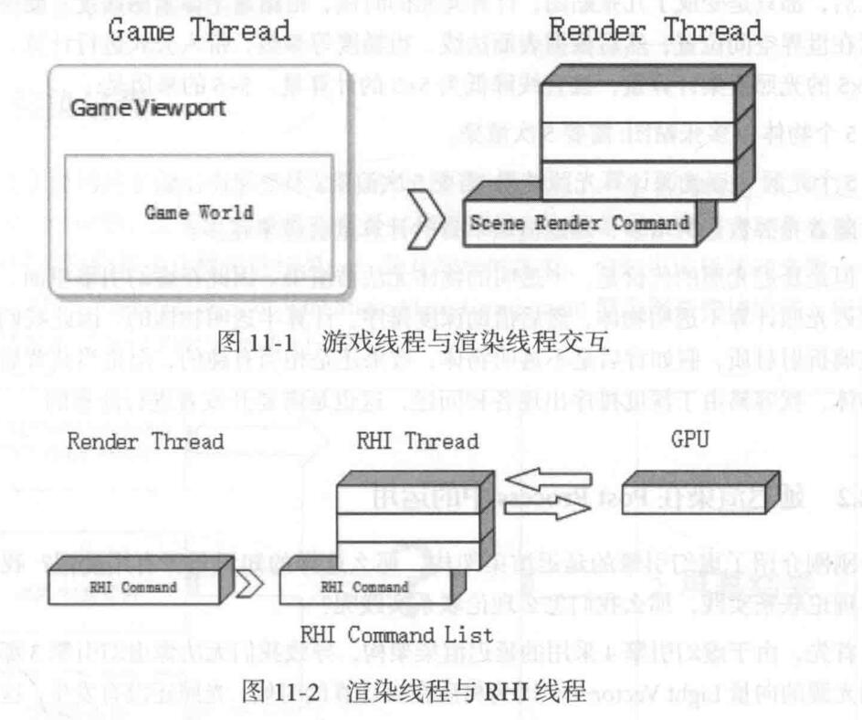
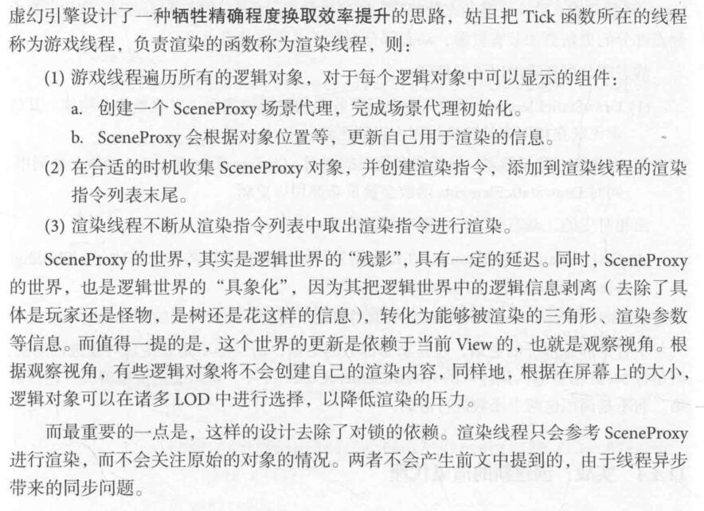

# 20201106

```markdown
* 《大象无形-虚幻引擎程序设计浅析》Part1、Part2 阅读与笔记(完成度：80%)
```

#### 第一部分 虚幻引擎C++编程

##### 核心的五个类：

* UObject

  在虚幻引擎中，最基础的构建单元叫做 Object，它包含了很多游戏资产必需的 "幕后" 功能。虚幻引擎4中几乎所有第项都是继承自Object（或从中获取部分功能）。在C++中，`UObject` 是所有Object的基类，包含各类功能，诸如垃圾回收、通过元数据（UProperty）将变量公开给编辑器，以及保存和加载时的序列化功能。

  提供垃圾回收、反射、序列化、运行时类型识别、网络复制、虚幻引擎编辑器的自动交互等功能。

  使用适当的宏标记类、属性和函数可以将它们转变为`UClasses、UProperties`和`UFunctions`。这让虚幻引擎能够访问它们，从而允许实现一些后台处理功能

* Actor

  能够挂载组件。可放入关卡中的对象都是 Actor。Actor是一种支持三维变换（如平移、旋转和缩放）的泛型类。你可以通过游戏逻辑代码（C++或蓝图）创建（生成）及销毁Actor。在C++中，AActor是所有Actor的基类。

* Pawn

  被操作控制。Pawn 是Actor的子类，它可以充当游戏中的化身或人物，例如游戏中的角色。Pawn可以由玩家控制，也可以由游戏AI控制并以非玩家角色（NPC）的形式存在于游戏中。

  当Pawn被人类玩家或AI玩家控制时，它被视为 *已被控制（Possessed）*。相反，当Pawn未被人类玩家或AI玩家控制时，它被视为 *未被支配（Unpossessed）*。

* Controller

  控制器（Controller）是一种可以控制Pawn（或Pawn的派生类，例如角色（Character）），从而控制其动作的非实体Actor。人类玩家使用PlayerController控制Pawn，而AIController则对它们控制的Pawn实加人工智能效果。控制器用Possess函数控制Pawn，用Unpossess函数放弃控制Pawn。

* Character

  角色（Character）是Pawn Actor的子类，旨在用作玩家角色。角色子类包括碰撞设置、双足运动的输入绑定，以及由玩家控制的运动附加代码。


##### 虚幻引擎类命名规则：

* F    纯C++类，
* U    继承自UObject,但不继承自Actor
* A    继承自Actor
* S    Slate控件相关类
* H    HitResult相关类

注：虚幻引擎头文件工具Unreal Header Tool会在编译前检查你的类命名。如果类的命名出现错误，那么它会提出警告并终止编译。


##### 实例化：

* 类是-一个纯C++类型(F开头)：通过new来产生对象。
* 类继承自UObject但不继承自Actor：通过NewObject函数来产生出对象。
* 类继承自AActor：通过SpawnActor 函数来产生出对象。

* Slate 类： SNew 函数


##### 类对象的销毁：

* 纯C++类按既往经验
* UObject 类对象有自动垃圾回收机制，垃圾回收器会定期从根节点 Root 检查，不能用智能指针管理
* Actor 类 Destory 函数从所属的世界“销毁”，但相应内存的回收仍是系统决定的


##### 使得自己的C++函数对蓝图可见：

* UPROPERTY 宏
* UFUNCTION 宏

另参见：[UE4中的C++编程简介](https://docs.unrealengine.com/zh-CN/Programming/Introduction/index.html)、[GamePaly 属性](https://docs.unrealengine.com/zh-CN/Programming/UnrealArchitecture/Reference/Properties/index.html)


##### 游戏性框架之行为树

流控制：合成（Composites）节点：

* 选择器（Selector）
  * 从左到右执行分支，通常用于在子树之间进行选择。当选择器找到能够成功执行的子树时，将停止在子树之间移动。
* 序列（Sequence）
  * 从左到右执行分支，通常用于按顺序执行一系列子项。与选择器节点不同，序列节点会持续执行其子项，直到它遇到失败的节点。
* 简单平行（Simple Parallel）
  * 简单平行节点有两个"连接"。第一个是主任务，它只能分配一个任务节点（意味着没有合成节点）。第二个连接（后台分支）是主任务仍在运行时应该执行的活动。简单平行节点可能会在主任务完成后立即结束，或者等待后台分支的结束，具体依属性而定。

[行为树快速入门指南](https://docs.unrealengine.com/zh-CN/Engine/ArtificialIntelligence/BehaviorTrees/BehaviorTreeQuickStart/index.html)




##### 游戏性框架之网络框架

* CS模型、星型结构，中心服务器统一处理各个客户端的指令信息
* 广义的CS模型：**客户端是对服务端的拙劣模仿**（客户端预测服务端的行为，不仅仅去同步服务端，而是去模仿服务端；调整当前世界的位置，如模仿服务端位置，如果差距太大，就强行闪现修正）


引擎系统相关类

* 正则 "Regex.h"
* 路径处理 FPaths
* XML FastXML、FXmlFile
* Json "Json.h"
* 平台无关的文件读写与访问接口 FPlatformFilemanager
  * 读写、创建、拷贝、移动、删除、属性相关
* 简单读写文件 FFileHelper

* GConfig 文件配置
  * 读配置、写配置、刷新写入
* UE_LOG 日志
  * 等级类别 Log，Warning，Error；格式化输出
  * 自定义 Category ?
* 字符串处理
  * FName 无法改变、哈希存储
  * FText “被显示的字符串”、查找表存储、修改不安全性，Slate 控件的文字参数一般用这个
  * FString 提供修改操作，消耗高
* 编译器相关
  * 废弃函数的标记（提示）
  * 编译器指令实现跨平台（分别实现，不同调用）
* Images
  * IamgerWrapper 
  * 读取与格式转换


#### 第二部分 虚幻引擎

##### 模块机制

UE3 使用 MakeFile 来模拟模块

UE4 借助 UBT(Unreal Build Tool)引入模块机制

UE 源码四大部分：Runtime, Development, Editor, Plugin, 每个模块内部包含一个个小文件夹，每个文件夹对应一个模块。

每个模块文件夹应包含：Public文件夹、Private文件夹、.build.cs文件

模块的创建与引入略。

模块加载顺序略。

UBT 工作含有三个阶段：收集阶段、参数解析阶段、实际生成阶段，同时负责监视热加载，调用UHT收集各个模块的信息。

UnrealHeaderTool（UHT）是支持UObject系统的自定义解析和代码生成工具。代码编译分为两个阶段：

1. 调用UHT，它解析与虚幻相关的类元数据的C ++标头，并生成自定义代码以实现各种与UObject相关的功能。
2. 调用普通的C ++编译器来编译结果。

##### 内存分配

Windows下操作系统的内存分配方案：

* 标准 Malloc (ANSI)
* Intel TBB 内存分配器
* Binned 内存分配器

Intel TBB 内存分配器：

* scalable_allocator: 不在同一个内存池分配内存，解决多线程竞争带来的无谓消耗
* cache_aligned_allocator: 通过缓存对齐，避免假共享

##### 初始化过程

* PreInit: 完成设置路径、设置标准输出、初始化游戏主进程 GameThread 、初始化随机数系统、初始化TaskGraph任务系统、判断引擎启动模式等。之后调用 LoadCoreModules(CoreModules 亦即 CoreUObject)，随后，所有的PreInitModules会被启动起来。这些强大的模块是:引擎模块、渲染模块、动画蓝图、Slate 渲染模块、Slate 核心模块、贴图压缩模块和地形模块。当这些模块加载完毕后，AppInit 函数会被调用，进人引擎正式的初始化阶段。
* Init: 进入初始化流程，所有被加入内存中的模块，含有 PostEngineInit 函数都会被调用从而执行初始化。这一过程借助 IProjectManager 完成。
* 主循环：游戏主进程存在专门的引擎循环 EngineTick，注意渲染线程是独立更新的不在主循环中。

```C++
while(!GIsRequestingExit){
    EngineTick()
}
// 更新控制台变量。这些控制台变量可以使用控制台直接设置。
// 请求渲染线程更新当前帧率文字。
// 更新当前应用程序的时间，也就是App::DeltaTime。
// 更新内存分配器的状态。
// 请求渲染线程刷新当前的--些底层绘制资源。
// 等待Slate程序的输人状态捕获完成。
// 更新GEngine,调用GEngine ->Tick。
// 假如现在有个视频正在播放，需要等待视频播放完。之所以在GEngine之后等待，是因为GEngine会调用用户的代码，此时用户有可能会请求播放一一个视频。
// 更新SlateApplication。
// 更新RHI。
// 收集下一帧需要清理的UObject 对象。
```

##### 并行与并发

* Test：未通过，后续有需要再看
* 线程
  * FRunnable类实现 Init(), Run(), Exit()
  * TaskGraph系统实现（解决频繁创建和销毁线程过大代价问题）
  * Std::Thread
  * 线程同步
* 进程
  * Core 下 GenericPlatformProcess，提供 CreateProc 静态函数，返回 FProchandle 进程句柄

##### 对象模型-UObject

* 创建



​      内存分配阶段干涉标准的内存分配过程，先根据 UObject 的 UClass 信息结合内存对齐计算类成员总大小，在内存中分配一块合适的区域存放。然后使用构造函数指针 ClassConstructor完成对象构造(赋值)。

​       因故，不能直接给构造函数传参：__DefaultConstructor 只能采用一个参数，这个函数是预先定义好的，无法什么参数都传递。

* 序列化

  * 序列化指将一个对象变为更易保存的方式，写道持久存储中。

  * 反序列化从持久存储中读取数据，然后还原原先的对象。

  * UObject 的序列化和反序列化都对应函数 Serialize。
  * 序列化/反序列化是一个步骤——比如反序列化先创建实例化对象，然后根据数据去还原；而非通过一段数据直接就能获得对象。
  * UPackage 存储过程

* 释放与消亡

  * UObject 对象无法手动释放，只能手动请求 ConditionBeginDestroy 来完成销毁。其内部实现实际是设置当前 UObject 的 RF_BeginDestroyed 为真，然后通过 SetLinker 函数将当前对象从 linker 导出表中清除。在时机成熟时，由 FinishDestroy 函数完成 UObject 的销毁操作。
  * 触发销毁：典型情况下，垃圾回收器执行析构和回收。前者调用析构函数；后者回收当前UObject占用的内存。

* **垃圾回收**

  * 垃圾回收算法之引用计数算法。

    给每个对象进行使用状态的计数。

    * 优点：引用计数无需暂停，是将垃圾回收的过程分配到运行的过程中逐渐完成的。
    * 缺点：指针操作开销，频繁计数修改数值可能开销很大；存在环形引用问题。

  * 垃圾回收算法之标记-清扫算法

    追踪式 GC 的一种。追踪式引用计数算法会寻找整个对象引用网络，来寻找不需要垃圾回收的对象。存在基于此的优化算法。

    * 优点：不存在环形引用问题
    * 缺点：暂停，在遍历过程中会导致系统明显延迟；内存碎片问题（只释放垃圾而缺乏整理，导致可用空间越来越细碎，最终导致大型对象无法被分配）。

  * UObject 的标记-清扫算法

    * 线性遍历？
    * 基于簇进行加速？

##### 对象模型-Actor

* 创建 

  SpawnActor函数生成，只能从 UWorld 调用，从属于 World，不饿能直接独立构建。

* 加载

  前部分遵循 UObject 的加载过程，但只会调用 PostLoad 函数来做一些处理。

  如果希望在加载和创建Actor的时候均执行某段函数，应当如何重
  载函数完成。简而言之:

  * 希望在Actor生成的时候触发，但是不希望在Actor加载的时候触发，可以重载 PostActorCreated 这样的函数，具体时机可以查看前面的函数调用序列，主要取决于是否需要假定组件均已经初始化。
  * 希望在Actor加载的时候触发，可以重载 PostLoad 函数。
  * 希望均触发，可以按需求考虑重载 BeginPlay 函数。

* 释放与消亡

  通过手动请求 Destroy 实现

  * UWorld::DestroyActor 请求当前世界来摧毁自己
  * 触发垃圾回收：下一次垃圾回收过程开始的时候，会检测这个Actor已经没有任何引用(亦即从 ULevel 的 ActorList 中被取下)，且设置为 PendingKill

##### 渲染系统

异步的、多线程配合的过程

* 渲染线程

  “渲染线程是游戏线程的奴隶”：

  * 外包做事，不停完成游戏线程派送过来的任务
  * 渲染线程被游戏线程操控

  渲染前端-后端方案：

  * ID Tech 引擎采用将渲染指令打包成一个个数据包，发送到渲染线程进行执行的方式。

  渲染线程如果频繁阻塞同步，对整体效率会有极为不利的影响。

  虚幻引擎的渲染线程：

  * 启动于全局函数 StartRenderingThread 中，早于虚幻引擎主窗口的绘制。
  * 执行于全局函数 RenderingThraedMain 中
  * 游戏线程借助 EQUEUE_Render_COMMAND 系列宏，向渲染线程 TaskMap 中添加渲染任务。
  * 渲染线程不直接向 GPU 发送指令，而是将渲染命令添加到 RHICommandList RHI命令列表。由RHI线程不断去除指令，向GPU发送，并阻塞等待结果。



* 渲染架构

  * 延迟渲染 解决物体、光照数量带来的计算复杂度的问题
  * 

* 渲染过程

  * 

* 场景代理 SceneProxy

  渲染与逻辑分离：Actor基类+virsual Tick()+virsual Render()，可能Tick在每帧逻辑更新到一半时，Render渲染函数被调用了——渲染结果不固定。加锁解决的话，频繁阻塞成本过高。



* Shader

  （全局）着色器略

* 材质

  略

##### Slate 界面

Slate 是完全自定义、与平台无关的用户界面框架，旨在让工具和应用程序（比如虚幻编辑器）的用户界面或游戏中用户界面的构建过程变得有趣、高效。它将声明性语法与轻松设计、布局和风格组件的功能相结合，允许在UI上轻松实现创建和迭代。

Slate 是一个跨平台的、硬件加速的图形界面框架，采用了C++的泛型编程。

* Slate 的两次排布

  实现了分辨率自适应：首先，递归计算每个控件的大小，父控件会根据子控件来计算自己的大小。然后，根据控件大小，具体计算出每个控件的绘制位置。

* Slate 的更新

  略

* Slate 的渲染

  不是递归渲染，而是先准备、再渲染。

##### 蓝图

* 架构

  蓝图系统是一套依托于虚幻引擎现有UClass, UProperty, UFunction 框架，根植于虚幻引擎 Unreal Script 字节码编译器系统的一套可视化编程工具。

* 前端：蓝图存储与编辑

  数据结构 UEdGraph : Scheme，Nodes，SubGraphes

  存储方式：元数据metadata（UClass）,属性方法，方法数据

  编辑器，实际上是一个 Slate 空间，即 SGraphEditor

* 后端：蓝图的编译

  过程略，最终编译完成包含完整信息的 UClass 对象

* 蓝图虚拟机

  基于字节码和栈的虚拟机

  C++函数注册到蓝图

#### 第三部分 拓展虚幻引擎

##### 引擎独立应用程序

##### 插件开发

##### 自定义资源和编译器

附：

```markdown
* shader
    n. 著色器;着色程序
    

```

