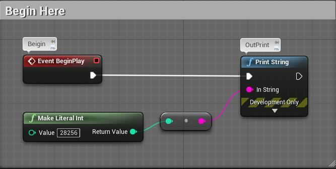
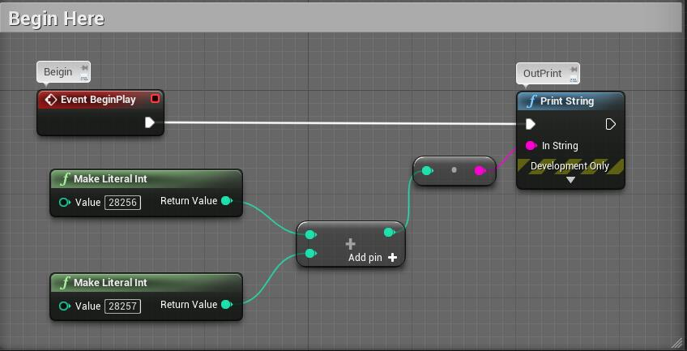
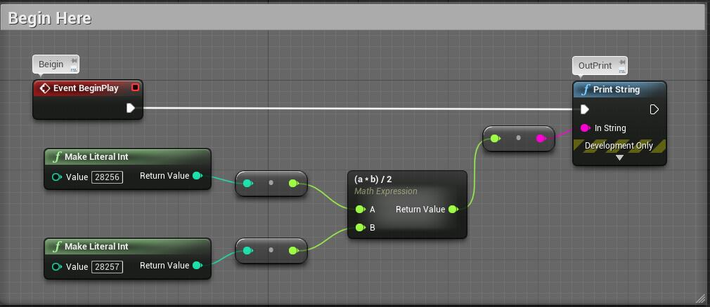
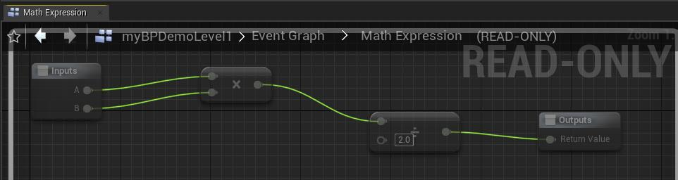
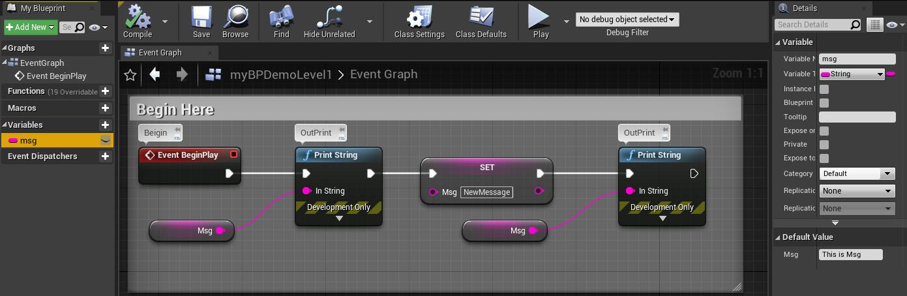
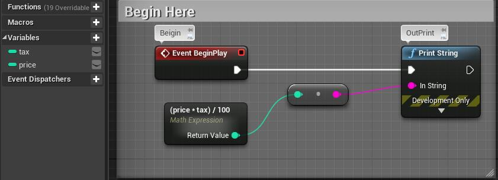
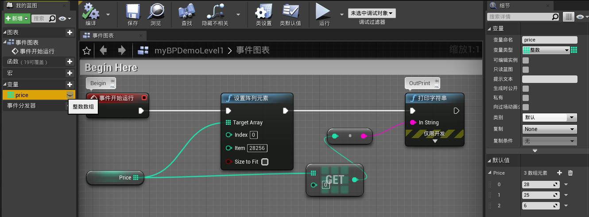
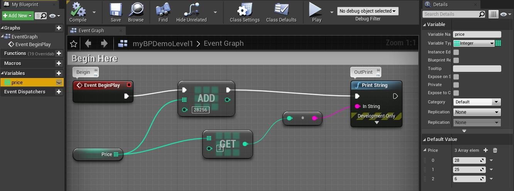
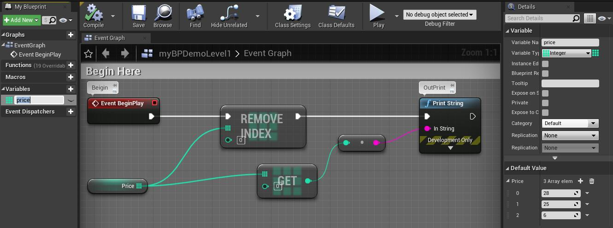
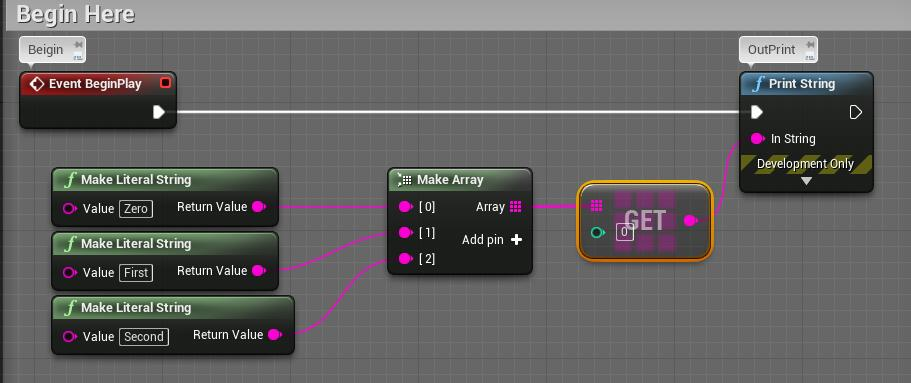

# 20201107

```markdown
* Unreal Engine 蓝图完全自学手册
```


蓝图类别：

* 关卡蓝图：游戏场景

* 游戏模式：游戏整体相关的设置、动作
* 类蓝图：集中处理几个相关功能与数据的小型程序


节点包含：

* 标题
* 左侧输入
* 右侧输出


节点特征

* 事件节点：
  * 事件节点：标题为红色，右侧白色五角形代表“执行处理的流程”
* 命令节点：
  * 执行节点：蓝色标题，左右两侧都有白色五角形标志
  * 读取节点：绿色标题，作用是向其他节点传递必要信息，没有设置处理顺序的白色五角形标志；右侧为接受读取值的项目


值类型：

* 文本Text，字符串String
* 整型Int，浮点型FLoat
* 布尔型Bool


容器：

* Map
* Set
* Array
* Single Variable


示例：

* IntCastToStr and PrintToSceen




* IntAdd




* MathExpression




* WhatHappenedInMathExpression

​        note: We can't change the expression after UE_4.6




* StrVariable




* UseVariableInMathExpression




* ArrayGetSet




* ArrayPushBack




* ArrayRemoveIndex




* CreateArrayOnRunTime




