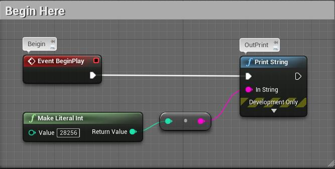
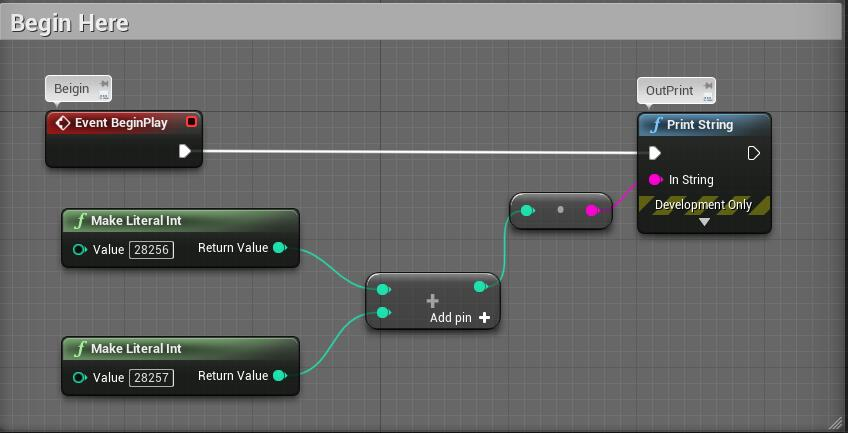
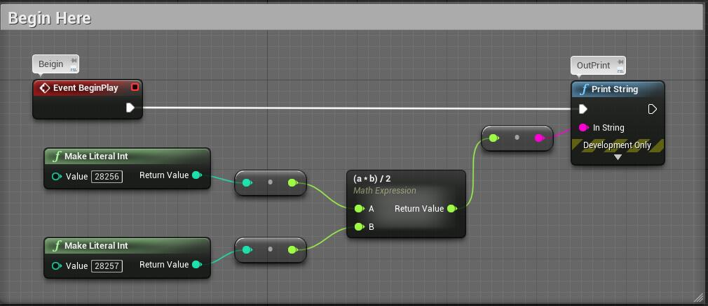
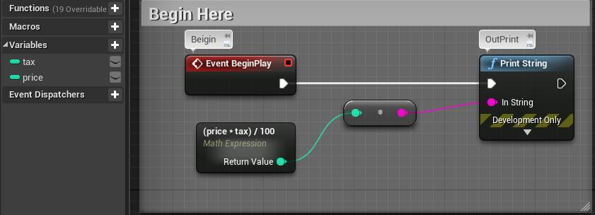
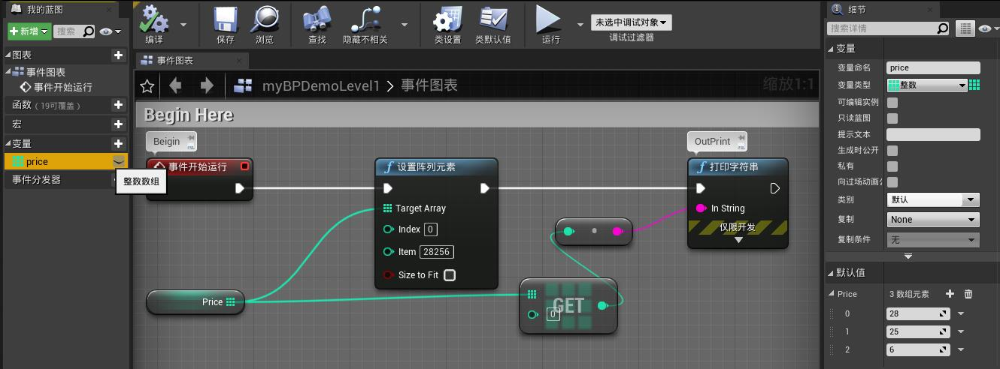
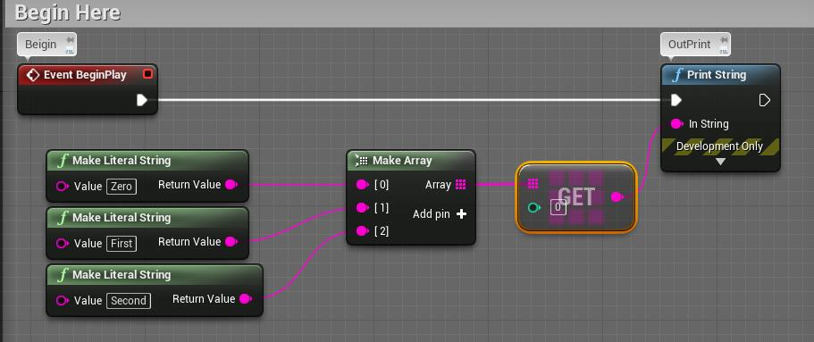

# 20201109

```markdown
* Unreal Engine 蓝图完全自学手册
```


#### 概念


蓝图类别：

* 关卡蓝图：游戏场景

* 游戏模式：游戏整体相关的设置、动作
* 类蓝图：集中处理几个相关功能与数据的小型程序


节点包含：

* 标题
* 左侧输入
* 右侧输出


节点特征

* 事件节点：
  * 事件节点：标题为红色，右侧白色五角形代表“执行处理的流程”
* 命令节点：
  * 执行节点：蓝色标题，左右两侧都有白色五角形标志
  * 读取节点：绿色标题，作用是向其他节点传递必要信息，没有设置处理顺序的白色五角形标志；右侧为接受读取值的项目


值类型：

* 文本Text，字符串String
* 整型Int，浮点型FLoat
* 布尔型Bool


容器：

* Map
* Set
* Array
* Single Variable


#### 蓝图示例：

##### Intro

* IntCastToStr and PrintToSceen




##### 值相关

* IntAdd




* MathExpression




* WhatHappenedInMathExpression

​        note: We can't change the expression after UE_4.6


* StrVariable


* UseVariableInMathExpression




* ArrayGetSet




* ArrayPushBack


* ArrayRemoveIndex


* CreateArrayOnRunTime




##### 流程控制

* BranchJump


* SwitchString


* SwitchStringBeautiful.jpg


* ForLoop


* ForEachLoop


* WhileLoop

略


* 节点结构化

拖动鼠标选中多个节点，单击鼠标右键，合并节点。合并节点可以嵌套继续合并。"我的蓝图" - "Prime Check" 可原样显示合并的节点。


* 创建宏

提高通用性，对于某个处理，各处都可以调用。

仅可处理接收的值，或将处理结果传给其他节点，但不包括 exec 输入输出项（无法使用流程控制）。


* 创建函数

提高通用性，对于某个处理，各处都可以调用。

具有 exec 输入输出项（可以连接 exec 项并按顺序执行处理），可以创建局部变量。


* 事件

蓝图中，程序是通过事件的发生而被调用的——创建程序后，如果不与事件相连，完全无法运行。


* Custom Event

自定义事件


* Break

For Loop With Break，配合 Do Break 节点使用。


* Flip Flop

触发器。交替执行。


* Sequence

序列，顺序调用。


##### Actor 运动 & 键鼠事件

* Tick

切换显示每一帧时发生的事件。


* AddActorLocalOffset

移动


* AddActorLocalRotation

旋转


* AddActorLocalTransform

Location, Rotation, Scale

需要 Make Transform 作为辅助


* 局部坐标 & 世界坐标

局部坐标：头脚、前后左右

世界坐标：上下、东西南北

 AddActorWorldOffset: 移动

AddActorWorldRotation: 旋转

AddActorWorldTransform: Location, Rotation, Scale


* Make Vector


* 使用键盘事件
  * 单击视口：鼠标和键盘的输入是由一个控制板接收的，而关卡编辑器中显示了很多的控制板，分别进行细节值的设定等。只是按键的话，系统不知道“输入到哪里”。因此需要单击控制板（或者输入区域等），事先指定“输入到这里”，并将事件传送到备选的控制板（视口）。
  * 连续移动
    * 创建变量表 vector，分别用按键的 pressed、released 事件连接控制，使用 tick 刷新
    * Is Input Key Down + Get Player Controller


* 使用鼠标事件
  * left mouse button
  * right mouse button
  * mouse X
  * mouse Y


* 调节速度

Delta Seconds 调整速度


##### 材质

* 材质亦即蓝图
* 材质的编程

* 使用参数进行编程


##### Advance


```markdown
* macro
    宏


```

